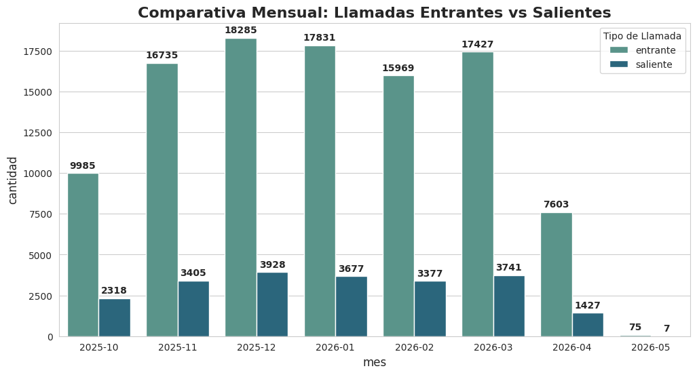

# Análisis de Operaciones - Call Center

Este proyecto analiza el volumen de llamadas mensuales para identificar patrones de demanda.

## 📊 Visualización de Resultados

## 📝 Análisis de Resultados y Recomendaciones

### 📞 Llamadas Entrantes
Se observa un aumento significativo en **noviembre, diciembre, enero y marzo**, con el pico más alto en **diciembre**.  
**Sugerencia:** Revisar si esto obedece a promociones de navidad, fallas en la red por congestión o soporte técnico de equipos nuevos.
### 📤 Llamadas Salientes
El pico más alto es en **diciembre**.  
**Sugerencia:** Validar si se debe a campañas de retención o captación de clientes por temporada navideña.
